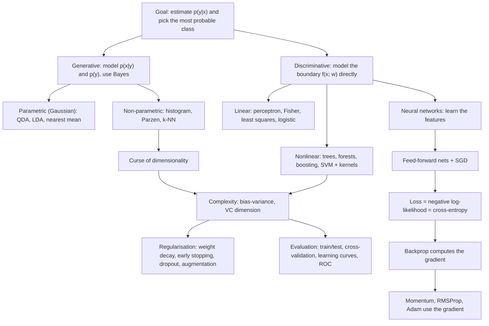

# Machine and Deep Learning (DSAIT4005) exam prep

New to the material? Read [[MDL Course walkthrough]] first: the whole course as one story.

Each lecture note has the same layout: **big picture, definitions, formulas, intuition, likely exam questions, book sections**.

## Notes by week

Week numbers come from the slide file names. Week 4 for the optimisers is inferred from the course schedule ("Optimization and Evaluation"); the DL decks are dated 3 and 17 Sept.

| Week | Note | Source slides | Lab |
|---|------|---------------|-----|
| 1 | [[ML 01 Bayes decision theory]] | week1a_introduction | Assignment 1 |
| 2 | [[ML 02 Density-based classification]] | week2a_classification | Assignment 1 |
| 2 | [[DL 01 Feed-forward networks and SGD]] | MDL02.2.feedforward | Assignment 2 |
| 3 | [[ML 03 Linear classifiers]] | week3a_LinearClassifiers | Assignment 4 |
| 3 | [[ML 04 Nonlinear classifiers]] | week3a_NonLinearClassifiers | |
| 3 | [[DL 02 Loss functions and maximum likelihood]] | MDL03b.1.loss | Assignment 3 |
| 3 | [[DL 03 Backpropagation]] | MDL03b.2.backprop | Assignment 3 |
| 4 | [[ML 05 Evaluation]] | week4b_evaluation | Assignment 6 |
| 4 | [[DL 04 Optimisers]] | no slides yet, from Assignment 5 | Assignment 5 |
| 5 | [[ML 06 Complexity and SVM]] | week5a_Complexity | Assignment 7 |
| 5 | [[ML 07 Regularisation]] | week5b_Regularisation | |
| 6 | CNNs and recurrent networks | not received | |
| 7 | Self-attention and unsupervised learning | not received | |
| 8 | Foundation models and Q&A | not received | |

Across weeks: [[MDL Formula sheet]] · [[MDL Practice questions]] · [[MDL Concepts]] (one note per definition, linked from the lecture notes)

## Flashcards
Every lecture note ends with a **Flashcards** section for the Spaced Repetition plugin. Open the command palette and run "Spaced Repetition: Review flashcards from all notes"; the decks are grouped as `flashcards/MDL/Week N`.

## How the course fits together

The three ideas that recur in every lecture:
1. **Everything is maximum likelihood in disguise.** Gaussian classifiers, logistic regression and cross-entropy for neural nets all maximise $\log p(\text{data};\theta)$.
2. **Complexity must match the amount of data.** Bias-variance, learning curves, curse of dimensionality, VC dimension and regularisation are the same story told five times.
3. **Gradient descent trains everything discriminative.** Perceptron, logistic regression, neural nets: define a loss, take the gradient, step downhill.

## What to focus on

Highest value (you should be able to compute or derive these by hand):
- Bayes' rule on 1D densities: posterior, decision boundary, effect of priors and of a loss matrix, Bayes error. → [[ML 01 Bayes decision theory]]
- QDA → LDA → nearest mean as increasingly strong covariance assumptions; estimating $\hat\mu$, $\hat\Sigma$ from a tiny dataset; why $\hat\Sigma$ can be singular. → [[ML 02 Density-based classification]]
- Least squares $\hat w=(X^TX)^{-1}X^Ty$ on a 4-point dataset; perceptron update; Fisher criterion; logistic model. → [[ML 03 Linear classifiers]]
- Bias-variance decomposition and reading learning/feature curves. → [[ML 03 Linear classifiers]], [[ML 05 Evaluation]]
- SVM: margin $2/\lVert w\rVert$, support vectors, slack and $C$, kernel trick with the polynomial-kernel example. → [[ML 06 Complexity and SVM]]
- Forward pass by hand on a small ReLU net, counting parameters, the XOR solution. → [[DL 01 Feed-forward networks and SGD]]
- Chain MLE ⇔ min KL ⇔ min cross-entropy ⇔ min NLL; why sigmoid + squared error is bad. → [[DL 02 Loss functions and maximum likelihood]]
- A full backprop step with bar notation (forward, backward, update, new loss). → [[DL 03 Backpropagation]]

Medium value (explain in words, know the formula):
- Parzen vs k-NN, choice of $h$ and $k$, feature scaling, curse of dimensionality.
- Trees (impurity), bagging, random forest, AdaBoost steps.
- Cross-validation, confusion matrix, precision/recall, ROC/AUC, reject option.
- L2 vs L1, early stopping, dropout, data augmentation.
- Momentum, RMSProp, Adam update rules and bias correction.

Lower value (recognise, don't memorise): the explicit QDA $W, w, w_0$ (slides say "no need to remember"), the VC generalisation bound, the neural-net norm bound.

> [!warning] How I judged "likely examinable"
> I have no past exam. The focus list is inferred from each lecture's stated learning goals, the in-slide "Q:/A:" questions, the "things to think about" slides and the pen-and-paper lab exercises. If you get a practice exam, give it to me and I will re-rank.

## What is missing

- The logistics deck lists these Deep Learning topics; I have **no slides** for the ones marked ✗:
  - ✓ Intro, feed-forward ✓ Backprop, losses
  - ✗ CNNs ✗ Optimization (only the lab) ✗ Recurrent networks ✗ Self-attention ✗ Unsupervised ✗ Foundation models
- The Roger Grosse handouts on Brightspace (MDL-Loss-RGrosse.pdf, MDL-BackProp-RGrosse.pdf) are referenced on almost every DL slide. Read them; the lecturer follows them equation by equation.

## Books

| Short | Book |
|---|---|
| PRML | Bishop, *Pattern Recognition and Machine Learning* (2006) |
| DL | Goodfellow, Bengio, Courville, *Deep Learning*, deeplearningbook.org |
| UDL | Prince, *Understanding Deep Learning* |
| D2L | Zhang et al., *Dive into Deep Learning* |

| Topic | PRML | DL book | UDL |
|---|---|---|---|
| Decision theory, loss matrix, reject | 1.5 | | |
| Gaussian, ML estimates | 2.3 | 3.9.3 | |
| Histogram, Parzen, k-NN | 2.5 | 5.7.3 | |
| Curse of dimensionality | 1.4 | 5.11.1 | |
| Generative Gaussian classifiers (LDA/QDA) | 4.2 | | |
| Least squares, Fisher, perceptron | 4.1.3, 4.1.4, 4.1.7 | | |
| Logistic regression | 4.3.2 | 5.7.1, 6.2.2.2 | 5.4 |
| Bias-variance | 3.2 | 5.4 | 8.2 |
| Trees, bagging, boosting | 14.2, 14.3, 14.4 | 7.11 | |
| Model selection, cross-validation | 1.3 | 5.3 | 8.5 |
| SVM, kernels | 7.1, 6.1, 6.2 | 5.7.2 | |
| Regularisation | 3.1.4, 5.5 | 7 | 9 |
| Feed-forward nets, XOR | 5.1 | 6, 6.1 | 3, 4 |
| Gradient descent, SGD | 5.2 | 4.3, 5.9 | 6 |
| MLE, KL, cross-entropy, softmax | 1.6, 4.3.4 | 3.13, 5.5, 6.2 | 5 |
| Backprop | 5.3 | 6.5 | 7 |
| Momentum, RMSProp, Adam | | 8.3, 8.5 | 6.3, 6.4 |
