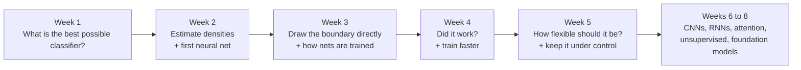

# MDL course walkthrough

[[00 MDL Index|↑ Index]] · [[MDL Concepts|Concept map]] · [[MDL Formula sheet|Formulas]] · [[MDL Practice questions|Practice]]

Read this first. It tells the course as one story, in the order it was taught, and explains why each topic exists. Every lecture has a full note with formulas; this page is the thread that connects them.

## The whole course in one paragraph

You are given examples with labels and want to predict the label of a new example. The ideal answer is known: pick the class with the highest [[Posterior probability|posterior]]. You never have the true posterior, so the course is a tour of ways to approximate it. First by modelling how each class looks (densities). Then by drawing the boundary directly (linear classifiers, then nonlinear ones). Then by letting a neural network learn its own features, which needs a loss, a way to compute gradients, and a good optimiser. Running through all of it is one question: how flexible should the model be for the amount of data you have, and how do you measure honestly whether it worked?

---

## Week 1 · What is the best you can do?

**Lecture:** [[ML 01 Bayes decision theory]]

The course opens with the pipeline: measure objects, turn them into [[Feature vector|feature vectors]], collect labels, train a classifier, and test it on data it has not seen. The warning that comes with it returns in week 4: a classifier always looks better on the examples it was trained on.

Then the central idea. An object $x$ could belong to several classes; what we want is $p(y\mid x)$ for each class. [[Bayes' theorem]] builds that from two things that are easier to think about: how common each class is (the [[Class prior|prior]]) and what objects of that class look like (the [[Class-conditional density|class-conditional density]]). Assigning each object to the most probable class gives the [[Bayes classifier]], and nothing can beat it.

![[bayes_1d.png]]

Two consequences matter for the exam:
- Even the best classifier makes mistakes where the classes overlap. That floor is the [[Bayes error]]. It belongs to the data, not to your method.
- If one kind of mistake is worse than the other, attach a [[Misclassification cost|cost]] to each. The rule stays the same; the posteriors are just rescaled, and the [[Decision boundary|boundary]] shifts away from the class that is expensive to miss.

**Why it matters for the rest:** every later method is judged against this ideal. The rest of the course answers "how do I get close to the Bayes classifier when I only have a finite training set?"

---

## Week 2 · Approach one: model each class

**Lecture:** [[ML 02 Density-based classification]]

The most direct route: estimate the ingredients of Bayes' rule from data and plug them in ([[Plug-in Bayes classifier|plug-in Bayes]]). The question becomes how to model $p(x\mid y)$.

*Parametric.* Assume each class is a [[Gaussian distribution|Gaussian]] and estimate its mean and [[Covariance matrix|covariance]]. How much you let the covariance vary gives three classifiers of decreasing flexibility: [[QDA]] (own covariance per class, curved boundary), [[LDA]] (one shared covariance, straight boundary) and the [[Nearest mean classifier|nearest mean classifier]] (round blobs, just compare distances to the means). Fewer parameters means less data needed, but a cruder model. This is the first appearance of the course's main trade-off.

*Non-parametric.* Assume nothing about the shape; let the data speak. A [[Histogram density estimate|histogram]] counts points per bin. [[Parzen density estimate|Parzen]] puts a small bump on every training point. [[k-nearest neighbours|k-NN]] grows a ball until it contains $k$ points, which as a classifier is simply a majority vote among neighbours. Each has one knob (bin width, $h$, $k$) that controls smoothness.

![[parzen_width.png]]

Then the catch that motivates week 3: the [[Curse of dimensionality|curse of dimensionality]]. With many features, space becomes so empty that estimating a density needs an exponential amount of data. Estimating a full density is a harder problem than the one you actually need to solve, which is only finding the boundary. That distinction is [[Generative vs discriminative|generative versus discriminative]].

**Lecture:** [[DL 01 Feed-forward networks and SGD]]

In parallel the deep learning track starts from the other end. A [[Feed-forward network|feed-forward network]] is a chain of layers, each a linear map followed by an [[Activation function|activation function]] such as [[ReLU]]. The nonlinearity is essential: without it the whole chain collapses into one linear map. The [[XOR problem|XOR example]] shows what the hidden layer buys you. No straight line separates XOR in the input space, but the hidden layer moves the points so that a straight line does.

![[xor.png]]

Training is a loop: run the input through, compare with the label, nudge the parameters downhill. "Downhill" is [[Gradient descent|gradient descent]]; using a small batch of data per step instead of all of it is [[Stochastic gradient descent|SGD]]. Two questions are left open and answered in week 3: what exactly to minimise, and how to get the gradient.

---

## Week 3 · Approach two: draw the boundary directly

**Lecture:** [[ML 03 Linear classifiers]]

Skip the densities. Assume the boundary is a straight line, $g(x)=w^Tx+w_0$, pick a loss, and optimise $w$. Four classifiers share this model and differ only in what they call "good":
- the [[Perceptron|perceptron]] pushes on misclassified points until none are left,
- [[Fisher linear discriminant|Fisher]] finds the direction in which the classes are furthest apart relative to their spread,
- [[Least squares|least squares]] treats the labels as numbers and does regression,
- [[Logistic regression|logistic regression]] assumes the log-odds are linear and maximises the likelihood.

The lecture ends with the theory behind the trade-off you met in week 2. The [[Bias-variance tradeoff|bias-variance decomposition]] splits the expected error into a part from the model being too rigid (bias) and a part from it being too sensitive to the particular training set (variance). LDA is rigid and stable; k-NN is flexible and jumpy.

![[learning_and_feature_curves.png]]

**Lecture:** [[ML 04 Nonlinear classifiers]]

A line is often not enough. Most nonlinear classifiers are simple pieces combined. You can add nonlinear features by hand. You can grow a [[Decision tree|decision tree]], which asks one question per node and splits to reduce [[Impurity|impurity]]; trees are easy to read but unstable. [[Bagging]] and [[Random forest|random forests]] average many randomised trees to reduce variance. [[Boosting]] and [[AdaBoost]] instead add weak classifiers one by one, each focusing on the previous mistakes, to reduce bias. The lecture closes by noting that a trained combination of perceptrons is a neural network, which is where the two tracks meet.

**Lecture:** [[DL 02 Loss functions and maximum likelihood]]

This answers "what to minimise". The principle is [[Maximum likelihood estimation|maximum likelihood]]: choose the parameters under which the observed labels are most probable. Rewritten, that is the same as minimising the [[KL divergence]] between data and model, which is the same as minimising [[Cross-entropy|cross-entropy]]. So the loss is not a free choice. It follows from the output unit: a [[Sigmoid|sigmoid]] for two classes, a [[Softmax|softmax]] for many.

The memorable lesson is why [[Squared error loss|squared error]] is wrong for classification. With a sigmoid, its gradient fades exactly when the prediction is confidently wrong, so learning stalls. Cross-entropy gives the clean gradient "prediction minus target". Note that this is logistic regression from the ML track seen from the DL side.

![[loss_se_vs_ce.png]]

**Lecture:** [[DL 03 Backpropagation]]

This answers "how to get the gradient". [[Backpropagation]] is the [[Chain rule|chain rule]] done in a sensible order. Run a [[Forward and backward pass|forward pass]] to compute every value, then walk the [[Computational graph|computational graph]] backwards from the loss, computing each derivative once and re-using it. The [[Bar notation|bar notation]] $\bar v=dL/dv$ keeps the bookkeeping short. Keep the two jobs apart: backprop *computes* the gradient, gradient descent *uses* it.

---

## Week 4 · Did it work, and can we train faster?

**Lecture:** [[ML 05 Evaluation]]

Now that you can build classifiers, you need to judge them. The [[True error and apparent error|apparent error]] on the training set is optimistic, so you hold data back or rotate it with [[Cross-validation|cross-validation]]. The [[Learning curve|learning curve]] (error against training size) and [[Feature curve|feature curve]] (error against complexity) are the two diagnostic plots; together they show that a complex classifier loses on small datasets and wins on large ones, so there is no single best classifier.

A single error number also hides things. The [[Confusion matrix|confusion matrix]] shows which mistakes are made; [[Precision and recall|precision and recall]] measure them per class; the [[ROC curve]] shows every trade-off the classifier can offer as its threshold moves; and the [[Reject option|reject option]] lets it say "I don't know". This links back to week 1: costs and priors decide where on the ROC curve you operate. The lecture also names something you have been doing since week 3: the losses we optimise are [[Surrogate loss|surrogates]] for the classification error, which cannot be optimised directly.

![[roc.png]]

**Lecture:** [[DL 04 Optimisers]] (from the lab only)

Plain SGD zig-zags in narrow valleys and is noisy. Three fixes, all built on the [[Exponentially weighted moving average|exponentially weighted moving average]]: [[Momentum|momentum]] averages the gradient so consistent directions build speed; [[RMSProp]] averages the squared gradient to give each parameter its own step size; [[Adam]] does both and corrects the start-up bias.

![[optimizers.png]]

---

## Week 5 · How flexible should the model be?

**Lecture:** [[ML 06 Complexity and SVM]]

The trade-off from weeks 2 and 3 gets a formal treatment. Complexity means flexibility, and it must match the training set size. Counting parameters does not measure it. The [[VC dimension]] does: the largest number of points the classifier can label in every possible way.

The [[Support vector machine|support vector machine]] is what you get if you design a linear classifier to have a low VC dimension: choose the separating line with the widest [[Margin|margin]]. Only the few points on the margin, the [[Support vectors|support vectors]], determine it. [[Slack variables]] allow for overlapping classes. And because the solution only uses inner products between objects, swapping the inner product for a kernel (the [[Kernel trick|kernel trick]]) makes it nonlinear at no extra cost. Compare this with week 2: a Gaussian kernel on every support vector looks a lot like Parzen, but with most training points thrown away.

![[svm_margin.png]]

**Lecture:** [[ML 07 Regularisation]]

The modern recipe is a very large model plus techniques that stop it [[Overfitting|overfitting]]. [[Regularisation]] is the name for those techniques. You can add data ([[Data augmentation|augmentation]]), penalise large weights ([[Weight decay|L2 / weight decay]], or [[L1 regularisation|L1]] which also zeroes weights out), stop training before the weights grow ([[Early stopping|early stopping]]), add noise, tie weights together ([[Parameter sharing|parameter sharing]], the idea behind CNNs), or randomly switch off units ([[Dropout|dropout]]). The $\lambda I$ added to a covariance matrix in the previous lecture is the same idea in a classical classifier.

![[l1_vs_l2.png]]

This lecture is where the ML and DL tracks fully merge: the bias-variance and learning-curve language from the ML side is applied to neural networks.

---

## Weeks 6 to 8 · Still to come

The schedule lists CNNs and recurrent networks, self-attention and unsupervised learning, then foundation models and a Q&A. I have no slides for these yet, so there are no notes. In one line each, as orientation only and not taken from the course material:
- **CNNs** apply parameter sharing to images: one small filter slides over the whole input.
- **Recurrent networks** share parameters across time steps to process sequences.
- **Self-attention** lets every element of a sequence look at every other one; it is the core of transformers.
- **Unsupervised learning** learns structure without labels.
- **Foundation models** are very large pretrained networks adapted to many tasks.

---

## Threads that run through everything

| Thread | Where it shows up |
|---|---|
| Approximate $p(y\mid x)$ | Bayes (W1), densities (W2), logistic (W3), softmax outputs (W3) |
| Maximum likelihood | Gaussian estimates (W2), logistic (W3), cross-entropy (W3) |
| Flexibility versus data | QDA/LDA/nearest mean and $h$, $k$ (W2), bias-variance (W3), learning curves (W4), VC dimension and $C$ (W5), regularisation (W5) |
| Define a loss, follow the gradient | Perceptron and logistic (W3), SGD (W2), backprop (W3), optimisers (W4) |
| Linear model on better features | Nonlinear features (W3), kernels (W5), learned hidden layers (W2) |

## Suggested order for revising

1. This page, once, to get the map.
2. Weeks 1 to 3 of the ML track in order; each builds on the last.
3. The three DL notes of weeks 2 and 3 as one block: network, loss, backprop.
4. Evaluation, then complexity and regularisation together.
5. [[MDL Practice questions]] by hand, then the flashcards daily.
