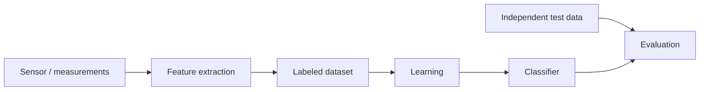

# ML 01 · Introduction and Bayes decision theory

[[00 MDL Index|↑ Index]] · [[DL 01 Feed-forward networks and SGD|DL 01 →]]

## Big picture
Machine learning = **learning from examples**. Classification = predict the label of an object. The best possible classifier is the **[[Bayes classifier]]**: assign the class with the highest [[Posterior probability|posterior]] $p(y\mid x)$. Everything else in the ML half is a way of estimating or side-stepping $p(y\mid x)$. When [[Misclassification cost|misclassification costs]] differ, you only need to **rescale the posteriors**.

## The pattern recognition pipeline

- **Labels need experts.** Ask where the label comes from (the image itself or an external source), what the ground truth is, and whether the measurements even contain the information needed.
- **Good features**: classes are clearly different, confusion comes only from measurement noise. **Poor features**: even experts are unsure (healthy vs diseased) and it is unclear what to measure.
- **Always check on independent test data.** Judging on the examples you trained on is [[Overfitting|overfitting]] to the training data.

## Definitions
- **Object** as a **[[Feature vector|feature vector]]** $x=(x_1,\dots,x_p)$ in a $p$-dimensional feature space, drawn from a joint density $p(x,y)$.
- **Classification**: assign a class label to each object; this splits the feature space into regions $\Omega_i$.
- **Regression**: real-valued outputs instead of class labels. **Clustering**: no labels (unsupervised).
- **[[Class prior]]** $p(y)$, **[[Class-conditional density|class-conditional density]]** $p(x\mid y)$, **posterior** $p(y\mid x)$, **unconditional data density** $p(x)$.
- **[[Decision boundary]]**: where $p(y_1\mid x)=p(y_2\mid x)$.
- **[[Bayes error]]** $\varepsilon^*$: the minimum attainable error.

## Formulas
Four equivalent ways to write the two-class classifier (assign $y_1$ if ...):
$$p(y_1\mid x)>p(y_2\mid x)\quad\Leftrightarrow\quad p(y_1\mid x)-p(y_2\mid x)>0\quad\Leftrightarrow\quad\frac{p(y_1\mid x)}{p(y_2\mid x)}>1\quad\Leftrightarrow\quad\log p(y_1\mid x)-\log p(y_2\mid x)>0$$

[[Bayes' theorem]] and the law of total probability (so $p(x)$ never has to be estimated separately):
$$p(y\mid x)=\frac{p(x\mid y)\,p(y)}{p(x)},\qquad p(x)=\sum_{i=1}^{C}p(x\mid y_i)\,p(y_i)$$

Recipe: (1) estimate the class-conditional densities, (2) multiply by the class priors, (3) normalise to get posteriors, (4) assign to the highest posterior.

Classification error of a given boundary, and the Bayes error:
$$p(\text{error})=\sum_{i=1}^{C}p(\text{error}\mid y_i)\,p(y_i),\qquad\varepsilon^*=\int\min\big[\,p(x\mid y_1)p(y_1),\ p(x\mid y_2)p(y_2)\,\big]\,dx$$

![[bayes_1d.png]]

## Classification error, step by step (slides 40 to 43)

The setting from the slides: two 1D Gaussian classes, drawn already multiplied by their priors, so the curves are $p(x\mid y_1)p(y_1)$ (blue) and $p(x\mid y_2)p(y_2)$ (red). Blue bars and red stars are training objects. The green line is the decision threshold: everything left of it is assigned to $y_1$, everything right of it to $y_2$. My curves are fitted by eye to the slide figure, so the numbers are illustrative, not the lecturer's.

**1. Any threshold makes two kinds of error.**
$$p(\text{error})=\sum_{i=1}^{C}p(\text{error}\mid y_i)\,p(y_i)=\underbrace{\int_{x\to y_2}p(x\mid y_1)p(y_1)\,dx}_{\text{Prob}(x\in y_1,\ x\to y_2)}+\underbrace{\int_{x\to y_1}p(x\mid y_2)p(y_2)\,dx}_{\text{Prob}(x\in y_2,\ x\to y_1)}$$
Each yellow area is one term: the part of a class's curve that falls on the wrong side of the line.

![[bayes_error_threshold.png]]

With the threshold at $x=0.6$ the blue tail on the right is large: many class-1 objects are sent to class 2.

**2. The Bayes error is the smallest possible yellow area.**
Move the line to where the two curves cross. Now at every $x$ you pick the class whose curve is higher, and the yellow area is exactly the area under the *lower* curve:
$$\varepsilon^*=\int\min\big[p(x\mid y_1)p(y_1),\ p(x\mid y_2)p(y_2)\big]\,dx$$

![[bayes_error_minimum.png]]

The error drops from 0.125 to 0.096, but not to zero: where the curves overlap, some objects of each class look exactly like the other class. That is why the slide says the Bayes error is *typically > 0*.

**3. Why the crossing point is optimal.**
Take a threshold left of the crossing. Between the threshold and the crossing, the blue curve is above the red one, yet you assign those objects to class 2. You pay the blue height instead of the red height there. The red wedge in the left plot is exactly that extra cost. Moving the threshold to the other side of the crossing creates the mirror-image wedge. So the total error, plotted against the threshold position, has its minimum at the crossing, and that minimum value is $\varepsilon^*$.

![[bayes_error_vs_threshold.png]]

**What changes the picture**
- A larger prior $p(y_1)$ scales the blue curve up, so the crossing (the Bayes boundary) moves right, into class 2's territory.
- Wider or closer classes overlap more, so $\varepsilon^*$ grows. No classifier can fix that; only better features can.
- In practice you never see the true curves, so you cannot compute $\varepsilon^*$. Your classifier's boundary is an estimate of the crossing point, and its error is always at least $\varepsilon^*$.

## Bayes error: what to know
- It is the **minimum** error and is typically **> 0** (the classes overlap).
- It depends on the **distribution of the data**, not on the classifier you use.
- You usually cannot compute it: the true class-conditional densities are unknown, and the integrals are high-dimensional.
- A better estimate of the posteriors gets your classifier *closer* to the Bayes error; it cannot lower the Bayes error itself.

## Misclassification costs
$\lambda_{ji}$ = cost of assigning an object that came from class $j$ to class $i$. Usually $\lambda_{ii}=0$. Example: $\lambda_{\text{healthy,ill}}=10$, $\lambda_{\text{ill,healthy}}=100$.

[[Conditional risk]] of assigning $x$ to class $i$, and the overall risk:
$$l_i(x)=\sum_{j=1}^{C}\lambda_{ji}\,p(y_j\mid x),\qquad r=\sum_{i=1}^{C}\int_{\Omega_i}\sum_{j=1}^{C}\lambda_{ji}\,p(y_j\mid x)\,p(x)\,dx$$
Minimum risk: put $x$ in region $\Omega_i$ if $l_i(x)\le l_k(x)$ for all $k$.

Two classes with $\lambda_{11}=\lambda_{22}=0$: compare $l_1=\lambda_{21}p(y_2\mid x)$ with $l_2=\lambda_{12}p(y_1\mid x)$.
$$\text{assign } y_1\quad\text{if}\quad\lambda_{12}\,p(y_1\mid x)>\lambda_{21}\,p(y_2\mid x)$$
So costs simply rescale the posteriors. The boundary moves **away** from the class that is expensive to miss.

## Intuition
- Multiplying by the prior scales a class density up or down. A bigger prior pushes the boundary away from that class, giving it more room. Costs act the same way.
- A class can end up with no region at all if its prior is small or it is very spread out.
- Two Gaussians with different variances give two boundaries: the wide one wins in both tails.

## Likely exam questions
- Given two 1D densities (Gaussian, uniform, triangular), find the decision boundary; redo it with unequal priors or a cost matrix.
- Compute posteriors for specific points and classify them.
- Compute the Bayes error as the area under the lower of the two scaled densities.
- Slide questions:
  - *True or not: if you estimate the posteriors better, you decrease the Bayes error.* **Not true.** The Bayes error is a property of the data.
  - *Is an error estimated from data larger, equal or smaller than the Bayes error?* The [[True error and apparent error|true error]] of any classifier is ≥ the Bayes error. (A training-set estimate can come out lower because it is optimistically biased.)
  - *What happens when $p(y_1)=2p(y_2)$?* The boundary shifts toward class 2, class 1's region grows.
- Why must you evaluate on independent test data?

Worked versions of Assignment 1 are in [[MDL Practice questions]].

## Books
PRML 1.5 (decision theory: 1.5.1 misclassification rate, 1.5.2 expected loss, 1.5.3 [[Reject option|reject option]]), 1.2 (probability refresher). DL book 3 (probability), 5.1 (learning algorithms).

## Flashcards
#flashcards/MDL/Week1

Bayes' theorem for the class posterior::$p(y\mid x)=\dfrac{p(x\mid y)\,p(y)}{p(x)}$

How do you get $p(x)$ without estimating it separately?::Law of total probability, $p(x)=\sum_i p(x\mid y_i)\,p(y_i)$

Name the three ingredients of Bayes' rule for classification::Class-conditional density $p(x\mid y)$, class prior $p(y)$, unconditional data density $p(x)$

What is the Bayes classifier?::Assign $x$ to the class with the largest posterior $p(y\mid x)$, using the true distributions. It is the best possible classifier.

What is the decision boundary between two classes?::The points where $p(y_1\mid x)=p(y_2\mid x)$

Give the four equivalent forms of the two-class decision rule::$p_1>p_2$; $p_1-p_2>0$; $p_1/p_2>1$; $\log p_1-\log p_2>0$ (with $p_i=p(y_i\mid x)$)

What is the Bayes error?::The minimum attainable error, $\int\min[p(x\mid y_1)p(y_1),\,p(x\mid y_2)p(y_2)]\,dx$. Typically greater than 0.

What does the Bayes error depend on?::Only on the distribution of the data (class overlap), not on the classification rule

Why can you usually not compute the Bayes error?::The true class-conditional densities are unknown and the integrals are high-dimensional

True or false, better posterior estimates reduce the Bayes error::False. They bring your classifier closer to the Bayes error, which itself is fixed by the data.

What does $\lambda_{ji}$ mean?::The cost of assigning an object that came from class $j$ to class $i$

Conditional risk of assigning $x$ to class $i$::$l_i(x)=\sum_j\lambda_{ji}\,p(y_j\mid x)$

Two-class minimum-risk rule (zero cost for correct decisions)::Assign $y_1$ if $\lambda_{12}\,p(y_1\mid x)>\lambda_{21}\,p(y_2\mid x)$

What do misclassification costs do to the Bayes classifier?::They only rescale the posteriors. The boundary moves away from the class that is expensive to miss.

What happens to the boundary when the prior of class 1 increases?::It shifts toward class 2, so class 1 gets a larger region

Classification vs regression vs clustering::Class labels; real-valued outputs; no labels (unsupervised)

Steps of the pattern recognition pipeline::Measurements, feature extraction, labeled dataset, learning, classifier, then evaluation on independent test data

Why evaluate on independent test data?::The error on the training data is optimistically biased (you overfit to your training data)
