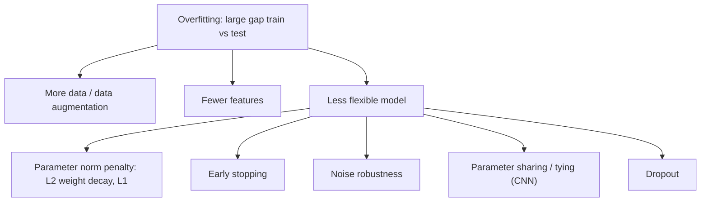

# ML 07 · Regularisation

[[ML 06 Complexity and SVM|← ML 06]] · [[00 MDL Index|↑ Index]] · [[DL 01 Feed-forward networks and SGD|DL 01 →]]

## Big picture
Modern practice: build a very large flexible model, then use tricks to stop it [[Overfitting|overfitting]]. Those tricks are [[Regularisation|regularisation]].

Two definitions (know both):
- Textbook: "regularisation is used to reduce overfitting."
- Goodfellow: "techniques to reduce the **test** error, possibly at the expense of increased training error." This one allows methods that actually *increase* flexibility.

## Underfitting and overfitting
Polynomial regression $f(x)=w_px^p+\dots+w_1x+w_0$: low degree underfits, degree 9 on 10 points overfits, something in between has appropriate capacity. Diagnose with the [[Learning curve|learning curve]]: a big gap between apparent and [[True error and apparent error|true error]] means overfitting.

## 1. Dataset augmentation
Generate extra training examples by applying transformations you know should not change the label (shifts, small distortions for digits). Only possible when you know the invariances. Not every transformation is safe: rotating a 6 by 180° gives a 9.

**[[Adversarial example|Adversarial examples]]**: a tiny perturbation in the direction of the loss gradient, $x+\epsilon\operatorname{sign}(\nabla_xJ(\theta,x,y))$, flips the prediction with high confidence (panda → gibbon). Adversarial training adds such examples to the training set.

Feature reduction is the other data-side remedy (out of fashion; sometimes done sneakily by downscaling images).

## 2. Why the weight norm matters
Generalisation bounds for neural nets have the form "true error < train error + something growing with the norm of the weights" (for a two-layer net roughly $\lVert w\rVert^3$) and shrinking with the number of training objects $m$. So keeping weights small keeps the gap small. Do not memorise the bound.

## 3a. Parameter norm penalties
$$\tilde J(\theta;X,y)=J(\theta;X,y)+\alpha\,\Omega(\theta)$$
$\alpha\ge0$ is the regularisation hyperparameter; larger = more regularisation.

**[[Weight decay|L2]] / weight decay / ridge / Tikhonov**
$$\tilde J=\frac{\alpha}{2}w^Tw+J\qquad\nabla_w\tilde J=\alpha w+\nabla_wJ$$
$$w\leftarrow w-\epsilon(\alpha w+\nabla_wJ)=(1-\epsilon\alpha)\,w-\epsilon\nabla_wJ$$
Every step first shrinks the weights by a constant factor, then does the usual gradient step. Discourages large weights; weights get small but not exactly zero.

**[[L1 regularisation|L1]]**
$$\tilde J=\alpha\lVert w\rVert_1+J\qquad\nabla_w\tilde J=\alpha\operatorname{sign}(w)+\nabla_wJ$$
The pull toward zero is a **constant**, not proportional to $w$, so weights reach **exactly 0**: sparse solutions, i.e. feature selection / neuron removal during training.

![[l1_vs_l2.png]]
The solution is where the loss contours first touch the penalty region. The L1 diamond has corners on the axes, so the touching point often has a coordinate equal to zero.

## 3b. Early stopping
Stop [[Gradient descent|gradient descent]] when the **validation** loss starts rising, before the training loss reaches its minimum.
- Starting from small weights, stopping early means the weights have not had time to grow: similar effect to L2.
- Almost free: no extra hyperparameter to grid-search, you just monitor the validation set.
- Needs **good initialisation**: start with small weights (network almost linear). Large initial weights are wrong and [[Early stopping|early stopping]] cannot help.
- During training the norm of the weights increases; the training curve shows plateaus and sudden drops.
- With early stopping you deliberately do not use the full potential of the network, your optimisation is "poor", and generalisation is better.

## 3c. Noise robustness
- Noise on the **inputs** = [[Data augmentation|data augmentation]].
- Noise on the **weights** = encourages stable solutions; with infinitesimal variance it is equivalent to a weight norm penalty.
- Noise on the **outputs** = label smoothing (targets 0.1/0.9 instead of 0/1).

## 3d. Parameter sharing / tying
Force groups of weights to be equal. Convolutional layers reuse the same filter at every position: a huge reduction in the number of weights (LeNet). The lecturer calls this one of the main reasons deep learning works.

## 3e. Dropout
At each training step randomly set a fraction of the nodes to 0 and [[Backpropagation|backprop]] through what is left. Described as a combination of weight decay and noise injection; also viewed as training an ensemble of sub-networks that share weights.

At test time either average a few (≈20) random sub-networks, or keep all nodes and **scale the weights by the keep probability** $p$:
$$w_{\text{new}}=w_{\text{org}}\cdot P[\text{kept}]+0\cdot P[\text{dropped}]=p\,w_{\text{org}}$$

> [!note] Which $p$?
> The slides use $p$ for the fraction dropped on one slide and for the keep probability in the rescaling formula. State your convention on the exam. The original paper uses $p$ = keep probability (0.5 hidden, 0.8 input).

Caveats from the lecture: works for wide networks, less for slim deep ones; not well suited to convolutional layers (alternatives: SpatialDropout, cutout); on very small datasets it may not help.

## Other regularisers
Batch normalisation (effect on complexity unclear), soft targets, student-teacher networks, combining models.

## Warnings
- Learning curves tell you when to regularise, but they are expensive and need repeats.
- **Do not keep looking at the test set.** Every peek influences your hyperparameter choices, so you overfit to it yourself.

## Likely exam questions
- Give both definitions of regularisation and the difference.
- Write the L2 update and show it equals weight decay. Contrast with L1 (gradient, sparsity).
- Why does early stopping regularise, and why does it need small initial weights?
- The three places to add noise and what each corresponds to.
- [[Dropout]] at training vs test time; derive the weight rescaling.
- Slide questions: Do you need regularisation with infinite data? (No: the training error converges to the true error.) Is the goal of training to reach the global optimum of the training loss? (No: the goal is low test error.) Must you change the regulariser if you change the loss? (At least re-tune $\alpha$: it balances two terms whose scale changed.)

## Books
DL book 7 (7.1 norm penalties, 7.4 augmentation, 7.5 noise, 7.8 early stopping, 7.9 [[Parameter sharing|parameter sharing]], 7.12 dropout, 7.13 adversarial training), 5.2 (capacity, over/underfitting). PRML 3.1.4 (regularised [[Least squares|least squares]]), 5.5 (regularisation in [[Feed-forward network|neural networks]]). UDL 9.

## Flashcards
#flashcards/MDL/Week5

Goodfellow's definition of regularisation::Techniques to reduce the test error, possibly at the expense of increased training error

How do you detect overfitting?::A large gap between the apparent (training) error and the true (test) error on the learning curve

Three general remedies for overfitting::More data or data augmentation, fewer features, a less flexible model

What is dataset augmentation and when can you use it?::Create extra training data with label-preserving transformations. Only possible when you know the invariances.

Adversarial example::$x+\epsilon\operatorname{sign}(\nabla_xJ(\theta,x,y))$, an imperceptible change that is misclassified with high confidence

Regularised objective::$\tilde J(\theta)=J(\theta)+\alpha\,\Omega(\theta)$

L2 penalty and its gradient::$\tilde J=\frac\alpha2w^Tw+J$, $\nabla_w\tilde J=\alpha w+\nabla_wJ$

L2 update as weight decay::$w\leftarrow(1-\epsilon\alpha)w-\epsilon\nabla_wJ$

Other names for L2 regularisation::Weight decay, ridge regression, Tikhonov regularisation

L1 penalty and its gradient::$\tilde J=\alpha\lVert w\rVert_1+J$, $\nabla_w\tilde J=\alpha\operatorname{sign}(w)+\nabla_wJ$

Key difference between L1 and L2::L1 drives weights to exactly zero (sparse, feature selection). L2 shrinks all weights but not to zero.

What is early stopping?::Stop training when the validation loss starts to rise

Why does early stopping regularise?::Starting from small weights, the weights have no time to grow large, similar to L2

What does early stopping need to work?::Good initialisation with small weights, so the initial network is almost linear

Noise on inputs, weights, outputs corresponds to::Data augmentation; weight norm regularisation (for tiny variance); label smoothing

Parameter sharing::Forcing weights to be equal, as in convolutions. A huge reduction in the number of weights.

Dropout during training::At each step randomly set a fraction of the nodes to 0 and backprop through the remaining network

Dropout at test time::Keep all nodes and scale weights by the keep probability, $w_{new}=p\,w_{org}$ (or average several sub-networks)

Do you need regularisation with infinite training data?::No, the training error then equals the true error

Why should you avoid looking at the test set repeatedly?::Each look influences your hyperparameter choices, so you overfit to the test set yourself
