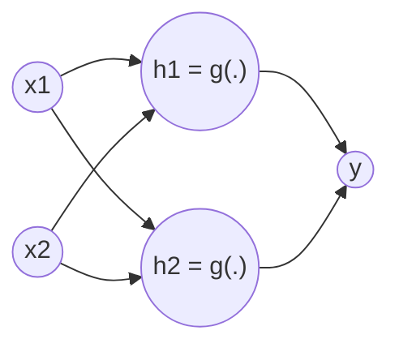

# DL 01 · Feed-forward networks and SGD

Back to [[00 MDL Index]] · previous [[ML 07 Regularisation]] · next [[DL 02 Loss functions and maximum likelihood]]
Slides: `MDL02.2.feedforward` (Jan van Gemert) · Lab: Assignment 2

## Big picture
A [[Feed-forward network|feed-forward network]] (multi-layer [[Perceptron|perceptron]], MLP) approximates a target function $f^*$ by a parameterised chain of simple functions $y=f(x;\theta)$. Training = adjust $\theta$ by [[Gradient descent|gradient descent]] so that $f$ matches $f^*$ on the data. What makes it "deep learning" is that the **features are learned**, not designed.

## Definitions
- **Layer**: one function in the chain $f(x)=f^{(3)}(f^{(2)}(f^{(1)}(x)))$. First layer is applied to the input; the last is the **output layer**; the ones in between are **hidden layers**. **Depth** = number of layers in the chain.
- **Parameters $\theta$**: all weights and biases.
- **[[Activation function]] $g$**: element-wise nonlinearity applied after the linear map.
- **[[ReLU]]**: $g(z)=\max\{0,z\}$.
- **Loss / cost / objective / error function**: the criterion that is minimised.

> [!note] Slide quirk
> The slides write the chain as $f^{(1)}(f^{(2)}(f^{(3)}(x)))$ and therefore call $f^{(3)}$ the first layer and $f^{(1)}$ the output. The idea is what counts: innermost = first layer, outermost = output.

## The model
One hidden layer, scalar output:
$$h=g(W^Tx+c),\qquad y=w^Th+b\qquad\Rightarrow\qquad f(x;W,c,w,b)=w^T\max\{0,\,W^Tx+c\}+b$$

**Counting parameters**: each layer has (inputs × outputs) weights + (outputs) biases. The slide network with 2 inputs, 2 hidden units, 1 output: $2\cdot2+2+2\cdot1+1=9$.



## Why a nonlinearity is needed
If $f_1(x)=W^Tx$ and $f_2(h)=w^Th$ then $f(x)=w^TW^Tx$: still one linear map. Stacking linear layers gains nothing. A linear last layer is fine, but the input to it must be made nonlinear. Three ways to get a nonlinear $\phi(x)$:
1. a generic kernel (e.g. RBF), see [[ML 06 Complexity and SVM]]
2. hand-designed feature extractors (e.g. SIFT)
3. **learn it**: $y=\phi(x;\theta)^Tw+b$ ← deep learning

![[activations.png]]

## XOR: the standard example
Inputs $X=\{(0,0),(0,1),(1,0),(1,1)\}$, labels $Y=\{0,1,1,0\}$. A linear model $x^Tw+b$ cannot fit it; the best it does under [[Squared error loss|squared error]] is $w=0,\ b=\tfrac12$, i.e. output ½ everywhere.

Solution with one hidden ReLU layer:
$$W=\begin{pmatrix}1&1\\1&1\end{pmatrix},\quad c=\begin{pmatrix}0\\-1\end{pmatrix},\quad w=\begin{pmatrix}1\\-2\end{pmatrix},\quad b=0$$

| $x$ | $W^Tx$ | $W^Tx+c$ | $h=\max(0,\cdot)$ | $y=w^Th$ |
|---|---|---|---|---|
| (0,0) | (0,0) | (0,−1) | (0,0) | 0 |
| (0,1) | (1,1) | (1,0) | (1,0) | 1 |
| (1,0) | (1,1) | (1,0) | (1,0) | 1 |
| (1,1) | (2,2) | (2,1) | (2,1) | 0 |

![[xor.png]]
The hidden layer folds the two "true" points onto the same spot, so in $h$-space one line separates the classes. That is representation learning.

## Training loop
```
while not converged:
    1. present a training sample      -> forward pass, get output
    2. compare output with the label  -> loss
    3. update the parameters          -> gradient step
```

## Gradient descent
- The derivative tells how the function changes for a small change in the input: $f(w+\epsilon)\approx f(w)+\epsilon f'(w)$.
- To reduce the loss, move against the sign of the derivative.
- **Partial derivative** $\partial L/\partial\theta_k$: effect of changing one parameter. **Gradient** $\nabla_\theta L$: the vector of all partial derivatives.

Mean squared error: $L(X,y;\theta)=\dfrac1n\sum_{i=1}^n\big(f(x^{(i)};\theta)-y^{(i)}\big)^2$

Update with [[Learning rate|learning rate]] $\epsilon$:
$$\theta^*=\theta-\epsilon\,\nabla_\theta L(X,y;\theta)$$

## Stochastic gradient descent (SGD)
Loss and gradient over all $m$ samples:
$$J(\theta)=\frac1m\sum_{i=1}^mL(x^{(i)},y^{(i)},\theta),\qquad\nabla_\theta J(\theta)=\frac1m\sum_{i=1}^m\nabla_\theta L(x^{(i)},y^{(i)},\theta)$$
With huge datasets one step would take too long. [[Stochastic gradient descent|SGD]] uses the exact gradient on a small **mini-batch** of $k$ samples as an estimate of the full gradient:
$$\theta^*=\theta-\epsilon\,\frac1k\sum_{i=1}^k\nabla_\theta L(x^{(i)},y^{(i)},\theta)$$

Better update rules built on this are in [[DL 04 Optimisers]]; how the gradient itself is computed is in [[DL 03 Backpropagation]].

## Likely exam questions
- Compute the output of a small ReLU network by hand (the opening slide: answer 1).
- Count the parameters of a given architecture.
- Show that two linear layers collapse into one.
- Verify the [[XOR problem|XOR]] solution; explain why a linear model fails; sketch the $h$-space.
- Write the GD and SGD update and name every symbol ($X$ data matrix, $y$ ground truth vector, $\theta$ learnable parameters, $\epsilon$ learning rate).
- Why SGD instead of full-batch gradient descent?
- The three routes to a nonlinear representation, and which one is deep learning.

## Books
DL book 6 and 6.1 (feed-forward nets, XOR), 4.3 (gradient-based optimisation), 5.9 (SGD). UDL 3, 4 (shallow and deep networks), 6.2 (SGD). PRML 5.1. D2L chapter 5 (multilayer perceptrons).

## Flashcards
#flashcards/MDL/Week2

What does a feed-forward network do?::Approximates a target function $f^*$ with a parameterised chain of functions $y=f(x;\theta)$ and learns $\theta$

One-hidden-layer network with ReLU::$f(x)=w^T\max\{0,\,W^Tx+c\}+b$

How many parameters does a fully connected layer have?::$n_{in}\cdot n_{out}$ weights plus $n_{out}$ biases

Parameters of a 2-2-1 network::$2\cdot2+2+2\cdot1+1=9$

Why do stacked linear layers need a nonlinearity?::$w^T(W^Tx)$ is again one linear map, so without an activation depth adds nothing

ReLU::$g(z)=\max\{0,z\}$, applied element-wise

Three ways to get a nonlinear representation $\phi(x)$::A generic kernel (RBF), hand-designed features (SIFT), or learning $\phi$. Learning it is deep learning.

Why can a linear model not solve XOR?::The classes are not linearly separable. The best least-squares fit is $w=0$, $b=\tfrac12$, output ½ everywhere.

XOR solution weights::$W=\begin{pmatrix}1&1\\1&1\end{pmatrix}$, $c=(0,-1)^T$, $w=(1,-2)^T$, $b=0$

What does the hidden layer do in the XOR solution?::It maps $(0,1)$ and $(1,0)$ to the same point $h=(1,0)$, making the classes linearly separable in $h$-space

The three steps of the training loop::Present a sample (forward pass), compare the result with the label (loss), update the parameters (gradient step)

What does the derivative tell you?::$f(w+\epsilon)\approx f(w)+\epsilon f'(w)$, how the output changes for a small change of the input

What is the gradient $\nabla_\theta L$?::The vector of all partial derivatives of the loss with respect to the parameters

Gradient descent update::$\theta^*=\theta-\epsilon\,\nabla_\theta L(X,y;\theta)$ with learning rate $\epsilon$

Mean squared error loss::$L=\frac1n\sum_i\big(f(x^{(i)};\theta)-y^{(i)}\big)^2$

SGD update::$\theta^*=\theta-\epsilon\,\frac1k\sum_{i=1}^k\nabla_\theta L(x^{(i)},y^{(i)},\theta)$ over a mini-batch of $k$ samples

Why SGD instead of the full-batch gradient?::With huge datasets one full gradient takes too long; a mini-batch gives a cheap estimate of it

Depth of a network::The number of layers (functions) in the chain
