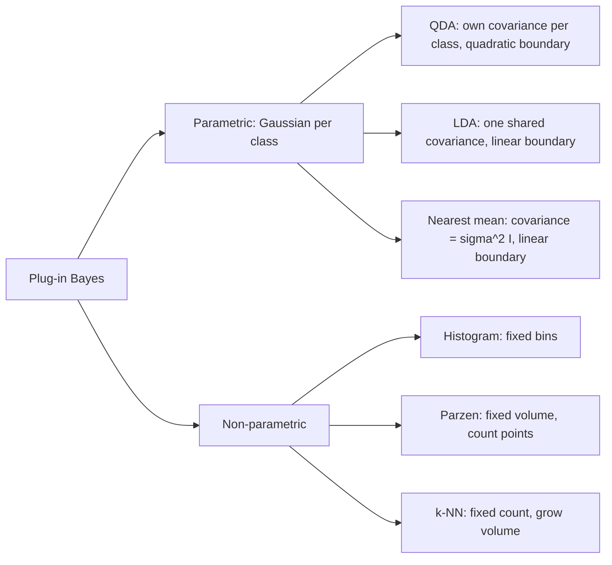

# ML 02 · Density-based classification

Back to [[00 MDL Index]] · previous [[ML 01 Bayes decision theory]] · next [[ML 03 Linear classifiers]]
Slides: `week2a_classification` (David Tax)

## Big picture
"Plug-in Bayes": estimate $\hat p(x\mid y)$ and $\hat p(y)$ from training data, plug them into Bayes' rule. The only real choice is the **model for the class-conditional density**: a Gaussian (parametric) or a sum of local bumps (non-parametric).

## Plug-in estimates
- Priors: $\hat p(y)=N_y/N$
- Unconditional: $\hat p(x)=\sum_i \hat p(x\mid y_i)\hat p(y_i)$
- Class-conditional: the modelling choice below.

## Gaussian (parametric) classifiers
$$p(x\mid y)=\frac{1}{\sqrt{(2\pi)^p\det\Sigma_y}}\exp\!\Big(-\tfrac12(x-\mu_y)^T\Sigma_y^{-1}(x-\mu_y)\Big)$$

Maximum-likelihood estimates:
$$\hat\mu=\frac1N\sum_{i=1}^N x_i,\qquad \hat\Sigma=\frac1N\sum_{i=1}^N (x_i-\hat\mu)(x_i-\hat\mu)^T$$

In 2D, $\Sigma=\begin{pmatrix}\sigma_1^2 & \rho\sigma_1\sigma_2\\ \rho\sigma_1\sigma_2 & \sigma_2^2\end{pmatrix}$: diagonal = spread per feature, off-diagonal = tilt of the ellipse.

Discriminant (log posterior without the class-independent terms):
$$g_i(x)=-\tfrac12\log\det\Sigma_i-\tfrac12(x-\mu_i)^T\Sigma_i^{-1}(x-\mu_i)+\log p(y_i)$$
Assign $x$ to the class with the largest $g_i$. For two classes use $f(x)=g_1(x)-g_2(x)$ and the sign.

| Classifier | Assumption | $f(x)$ | Parameters to estimate |
|---|---|---|---|
| **QDA** (quadratic, `qdc`) | each class its own $\Sigma_i$ | $x^TWx+w^Tx+w_0$ | most |
| **LDA** (linear, `ldc`) | shared $\Sigma=\frac1C\sum_k\hat\Sigma_k$ | $w^Tx+w_0$, $w=\hat\Sigma^{-1}(\hat\mu_1-\hat\mu_2)$ | fewer |
| **Nearest mean** (`nmc`) | $\Sigma=\sigma^2 I$ | $w^Tx+w_0$, $w=\hat\mu_1-\hat\mu_2$ | fewest |

> [!note] Sign convention
> The slides are inconsistent about whether $w$ is $\mu_1-\mu_2$ or $\mu_2-\mu_1$. It only flips which side is positive. With $f=\log p(y_1\mid x)-\log p(y_2\mid x)$, $w=\Sigma^{-1}(\mu_1-\mu_2)$ and $w_0=-\tfrac12\mu_1^T\Sigma^{-1}\mu_1+\tfrac12\mu_2^T\Sigma^{-1}\mu_2+\log\frac{p(y_1)}{p(y_2)}$.

Why the boundary becomes linear: with a shared $\Sigma$ the quadratic terms $x^T\Sigma^{-1}x$ cancel in $g_1-g_2$.

**Singular covariance.** In the slide example, class +1 has two points that differ in only one feature, so $\hat\Sigma=\begin{pmatrix}0.25&0\\0&0\end{pmatrix}$, one variance is 0 and the inverse does not exist. Rule of thumb: you need more objects than dimensions per class. Fixes: average the covariances (LDA), assume $\sigma^2I$ (nearest mean), or regularise $\Sigma+\lambda I$ (see [[ML 06 Complexity and SVM]]).

## Non-parametric density estimates
Idea: density ≈ (fraction of points) / (volume).

**Histogram**: bins of width $h$, $\hat p(x)=\dfrac{k_N}{N\,h}$ for $x$ in a bin holding $k_N$ points. Too large $h$ = imprecise, too small = unstable. Bin offset matters.

**Parzen**: put a kernel of fixed width $h$ on every training point and average:
$$\hat p(z\mid h)=\frac1n\sum_{i=1}^n K(\lVert z-x_i\rVert,h)$$
Parzen classifier: Gaussian kernel per class, $\hat p(x\mid y_i)=\frac1{n_i}\sum_{j}\mathcal N(x\mid x_j^{(i)},hI)$, then Bayes.

![[parzen_width.png]]

Choosing $h$: leave-one-out likelihood, a heuristic, or the average k-NN distance. Small $h$ overfits.

**k-nearest neighbour**: fix the count $k$, grow a sphere around the test point until it holds $k$ points:
$$\hat p(x)=\frac{k}{n\,V_k}$$
For classification with $k_m$ of the $k$ neighbours in class $m$: $\hat p(x\mid y_m)=\dfrac{k_m}{n_m V_k}$, $\hat p(y_m)=\dfrac{n_m}{n}$, so Bayes reduces to **majority vote**: pick the class with the largest $k_m$.

Choice of $k$: small $k$ = ragged boundary (high variance); large $k$ = smooth (high bias). As $k\to N$ every point gets the largest class, so the error tends to $\min(p(y_1),p(y_2))$. Some optimum in between.

**Scale your features.** Distances are dominated by the feature with the largest range, so Parzen and k-NN give strange results on unscaled data. Gaussian classifiers with a full covariance are not affected in the same way.

| Pros of non-parametric | Cons |
|---|---|
| simple, flexible, often very good | need large training sets |
| complexity easy to tune ($h$ or $k$) | whole training set stored, distances to all points at test time |
| | features must be scaled, $h$/$k$ must be tuned |

## Curse of dimensionality
The number of examples needed can grow **exponentially** with the number of features.
- Histogram with 10 bins per feature: $10^p$ cells ($10^{50}$ in 50D).
- Most volume is in the rim: $\mathrm{Vol}(0.9r)/\mathrm{Vol}(r)=0.9^p\to 0$. In 50D, $0.9^{50}\approx0.005$.
- More features can add noise, not information.

## Generative vs discriminative

| | Generative $\hat p(y\mid x)=\frac{\hat p(x\mid y)\hat p(y)}{\hat p(x)}$ | Discriminative $\hat p(y\mid x)=f(x;w)$ |
|---|---|---|
| + | gives a posterior; full data distribution so outliers can be detected; can use knowledge of how data is generated; easy ML estimates | very flexible; may need less data |
| − | needs large training sets; model may be too simple | must define a loss; optimisation can be hard; score not interpretable; outlier rejection unclear |

## Likely exam questions
- Estimate $\hat\mu$ and $\hat\Sigma$ for a 2–4 point class; say whether $\hat\Sigma^{-1}$ exists and why.
- Which of QDA / LDA / nearest mean gives a linear boundary, and under what assumption? Which needs the most data?
- Show that k-NN density + Bayes gives majority voting.
- Effect of $h$ or $k$ on smoothness, bias and variance; what happens at $k=1$ and $k=N$.
- Why must features be scaled for Parzen/k-NN?
- Explain the curse of dimensionality with the histogram or sphere argument.
- Advantages and disadvantages of generative vs discriminative.

## Books
PRML 2.3 (Gaussian; 2.3.4 ML estimates), 4.2 (probabilistic generative models, LDA/QDA), 2.5 (2.5.1 kernel density, 2.5.2 nearest neighbours), 1.4 (curse of dimensionality).

## Flashcards
#flashcards/MDL/Week2

What is a plug-in Bayes classifier?::Estimate $\hat p(x\mid y)$ and $\hat p(y)$ from training data and plug them into Bayes' rule

Usual estimate of the class prior::$\hat p(y)=N_y/N$

Multivariate Gaussian density::$p(x)=\dfrac{1}{\sqrt{(2\pi)^p\det\Sigma}}\exp\big(-\tfrac12(x-\mu)^T\Sigma^{-1}(x-\mu)\big)$

ML estimate of the mean and covariance::$\hat\mu=\frac1N\sum_i x_i$, $\hat\Sigma=\frac1N\sum_i(x_i-\hat\mu)(x_i-\hat\mu)^T$

Gaussian discriminant $g_i(x)$::$-\tfrac12\log\det\Sigma_i-\tfrac12(x-\mu_i)^T\Sigma_i^{-1}(x-\mu_i)+\log p(y_i)$

QDA assumption and boundary shape::Each class has its own covariance $\Sigma_i$; the boundary is quadratic, $x^TWx+w^Tx+w_0=0$

LDA assumption and boundary shape::All classes share one (averaged) covariance; the quadratic terms cancel and the boundary is linear

LDA weight vector::$w=\hat\Sigma^{-1}(\hat\mu_1-\hat\mu_2)$

Nearest mean classifier assumption::$\Sigma=\sigma^2I$ (equal variance, uncorrelated features). $w=\hat\mu_1-\hat\mu_2$, only distances to the class means matter.

Order QDA, LDA, nearest mean by number of parameters::QDA most, LDA fewer, nearest mean fewest. Fewer parameters means less data needed but more bias.

When is the estimated covariance matrix not invertible?::Too few objects relative to the dimensionality, or no variation in some direction (a variance of 0)

Three fixes for a singular covariance::Average covariances over classes (LDA), assume $\sigma^2I$ (nearest mean), or regularise $\Sigma+\lambda I$

Histogram density estimate::$\hat p(x)=\dfrac{k_N}{N\,h}$ with $k_N$ points in the bin of width $h$

Parzen density estimate::$\hat p(z)=\frac1n\sum_i K(\lVert z-x_i\rVert,h)$. Fixed kernel width $h$ on every training point.

k-NN density estimate::$\hat p(x)=\dfrac{k}{n\,V_k}$. Fixed count $k$, the volume $V_k$ grows until it holds $k$ points.

Parzen vs k-NN in one line::Parzen fixes the volume and counts points; k-NN fixes the count and measures the volume

Why is k-NN classification a majority vote?::$\hat p(x\mid y_m)\hat p(y_m)=\frac{k_m}{n_mV_k}\frac{n_m}{n}=\frac{k_m}{nV_k}$, so the largest posterior is the largest $k_m$

Effect of small vs large $k$ (or $h$)::Small gives a ragged boundary, high variance, overfitting. Large gives a smooth boundary, high bias.

k-NN error as $k\to N$::$\min(p(y_1),p(y_2))$, everything is assigned to the largest class

Why must features be scaled for Parzen and k-NN?::They use distances, which are dominated by the feature with the largest range

What is the curse of dimensionality?::The number of training examples needed can grow exponentially with the number of features

Histogram argument for the curse of dimensionality::10 bins per feature gives $10^p$ cells, e.g. $10^{50}$ in 50 dimensions

Sphere argument for the curse of dimensionality::$\mathrm{Vol}(0.9r)/\mathrm{Vol}(r)=0.9^p\to0$, so in high dimensions almost all data is in the outer rim

Generative vs discriminative classifier::Generative models $p(x\mid y)p(y)$ and uses Bayes. Discriminative models $p(y\mid x)=f(x;w)$ or the boundary directly.

Two advantages of generative classifiers::You get posteriors and the full data density (outlier detection); parameters are easy to estimate by maximum likelihood

Two disadvantages of discriminative classifiers::You must choose a loss and the optimisation can be hard; the output score is not interpretable and outlier rejection is not obvious
