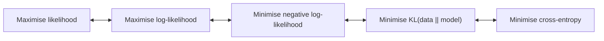

# DL 02 · Loss functions and maximum likelihood

Back to [[00 MDL Index]] · previous [[DL 01 Feed-forward networks and SGD]] · next [[DL 03 Backpropagation]]
Slides: `MDL03b.1.loss` (Jan van Gemert, after Roger Grosse) · Lab: Assignment 3 · Handout: MDL-Loss-RGrosse.pdf on Brightspace

## Big picture
Where do loss functions come from? From **maximum likelihood**. Choosing the output unit (linear, sigmoid, softmax) fixes the probability distribution the network predicts, and the negative log-likelihood of that distribution *is* the loss.

All five have the same $\arg$-optimum $\theta$. Be able to walk this chain.

## Maximum likelihood estimation (MLE)
Training set of $m$ i.i.d. samples $X=\{x^{(1)},\dots,x^{(m)}\}$ from $p_{\text{data}}$. Model family $p_{\text{model}}(x;\theta)$.

$$\theta_{ML}=\arg\max_\theta p_{\text{model}}(X;\theta)\overset{\text{i.i.d.}}{=}\arg\max_\theta\prod_{i=1}^mp_{\text{model}}(x^{(i)};\theta)$$
A product of numbers in $[0,1]$ underflows (numerically unstable). The log is monotone, so it keeps the arg-max and turns the product into a sum:
$$\theta_{ML}=\arg\max_\theta\sum_{i=1}^m\log p_{\text{model}}(x^{(i)};\theta)=\arg\max_\theta\ \mathbb E_{x\sim\hat p_{\text{data}}}\log p_{\text{model}}(x;\theta)$$
(dividing by $m$ does not move the arg-max; $\hat p$ means the empirical distribution of the samples).

## KL divergence and cross-entropy
$$D_{KL}(\hat p_{\text{data}}\,\Vert\,p_{\text{model}})=\mathbb E_{x\sim\hat p_{\text{data}}}\big[\log\hat p_{\text{data}}(x)-\log p_{\text{model}}(x;\theta)\big]$$
The first term does not depend on $\theta$. Dropping it leaves $\arg\min_\theta-\mathbb E_{x\sim\hat p_{\text{data}}}\log p_{\text{model}}(x;\theta)$, which is MLE.

$$H(p_{\text{data}},p_{\text{model}})=H(p_{\text{data}})+D_{KL}(p_{\text{data}}\Vert p_{\text{model}})$$
The entropy $H(p_{\text{data}})$ is a constant for the model, so minimising cross-entropy = minimising KL. "Cross-entropy" is a generic term, not only for classification.

**Conditional version** (classification: predict $y$ from $x$):
$$\theta_{ML}=\arg\max_\theta\sum_{i=1}^m\log P(y^{(i)}\mid x^{(i)};\theta)$$

## Binary classification
One number $y=P(Y=1\mid x)$ is enough (Bernoulli): $P(Y=0\mid x)=1-y$.

**Attempt 1: clipped linear unit** $y=\max\{0,\min\{1,w^Th+b\}\}$. Outside $[0,1]$ the gradient is zero, so gradient descent cannot fix those points.

**Attempt 2: sigmoid + squared error.**
$$z=w^Tx+b\ (\text{the logit}),\qquad y=\sigma(z)=\frac1{1+e^{-z}},\qquad L_{SE}=\tfrac12(y-t)^2$$
$$\frac{dL_{SE}}{dz}=(y-t)\,\sigma'(z),\qquad\sigma'(z)=\sigma(z)(1-\sigma(z))$$
Problem: for a confidently **wrong** prediction $\sigma'(z)\approx0$, so the step is tiny exactly when it should be large. (Separately, squared error on a raw linear output punishes being "too correct": for $t=1$, $y=10$ costs more than $y=0$.)

**Attempt 3: sigmoid + cross-entropy = logistic regression.**
$$L_{CE}(y,t)=-t\log y-(1-t)\log(1-y)=\begin{cases}-\log y&t=1\\-\log(1-y)&t=0\end{cases}$$
$$\frac{dL_{CE}}{dz}=y-t$$
The $\sigma'$ cancels. The gradient is large when the prediction is very wrong, and the loss grows linearly in $|z|$ there.

![[loss_se_vs_ce.png]]

## Multiclass classification
Targets as **one-hot** vectors $t=(0,\dots,0,1,0,\dots,0)$. **Softmax** turns $K$ logits into probabilities:
$$y_k=\operatorname{softmax}(z)_k=\frac{e^{z_k}}{\sum_{k'}e^{z_{k'}}}$$
- outputs are positive and sum to 1
- if one $z_k$ is much larger than the rest it approximates the arg-max
- it generalises the sigmoid (softmax over two logits $z$ and 0 gives $\sigma(z)$)

Cross-entropy loss and its gradient:
$$L_{CE}(y,t)=-\sum_{k=1}^Kt_k\log y_k=-t^T\log y,\qquad\frac{\partial L_{CE}}{\partial z}=y-t$$

## Output unit ↔ distribution ↔ loss

| Task | Output unit | Distribution | NLL loss | $\partial L/\partial z$ |
|---|---|---|---|---|
| Regression | linear $y=z$ | Gaussian | $\tfrac12(y-t)^2$ | $y-t$ |
| Binary | sigmoid | Bernoulli | $-t\log y-(1-t)\log(1-y)$ | $y-t$ |
| Multiclass | softmax | categorical | $-\sum_kt_k\log y_k$ | $y-t$ |

Matching the loss to the output unit always gives the clean gradient "prediction − target".

## Likely exam questions
- Derive the log-likelihood form from the product; say which assumption allows it (i.i.d.) and why the log is used (numerical stability, sums).
- Show MLE ⇔ minimising KL ⇔ minimising cross-entropy; say which term is dropped and why.
- Why not squared error with a sigmoid? Explain with the gradient.
- Write the binary cross-entropy both as cases and as one formula; sketch it for $t=1$ and $t=0$.
- Compute a softmax and its cross-entropy for given logits.
- Why is one output enough for two classes?
- What happens to gradients with the clipped linear unit?

## Books
DL book 5.5 (MLE; 5.5.1 conditional log-likelihood), 3.13 (KL, cross-entropy), 3.10 (sigmoid, softplus), 6.2.2 (output units: 6.2.2.2 sigmoid, 6.2.2.3 softmax), 5.7.1. UDL 5 (loss functions; 5.7 cross-entropy). PRML 1.6 (information theory), 4.3.2, 4.3.4 (multiclass logistic regression).
