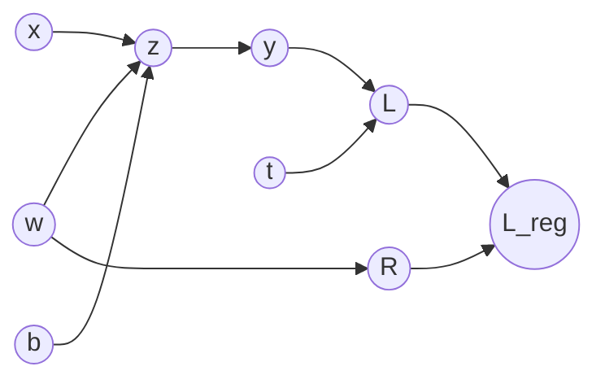

# DL 03 · Backpropagation

Back to [[00 MDL Index]] · previous [[DL 02 Loss functions and maximum likelihood]] · next [[DL 04 Optimisers]]
Slides: `MDL03b.2.backprop` (Jan van Gemert, after Roger Grosse) · Lab: Assignment 3 · Handout: MDL-BackProp-RGrosse.pdf on Brightspace

## Big picture
- **Gradient descent** decides how to *use* a gradient to update parameters.
- **Backpropagation** is the algorithm that *computes* that gradient efficiently.

Backprop is "just" the chain rule, organised so that every intermediate derivative is computed once and re-used. It is what makes end-to-end training and representation learning possible.

| Training step | What happens |
|---|---|
| 1. Present a sample | **forward pass**: compute all values |
| 2. Compare with label | compute the **loss** |
| 3. Update weights | **backward pass** (backprop) gives the gradient, then a gradient-descent step |

## Chain rule
Single variable, with $y=g(x)$, $z=f(y)$:
$$\big(f(g(x))\big)'=f'(g(x))\,g'(x)\qquad\Longleftrightarrow\qquad\frac{dz}{dx}=\frac{dz}{dy}\frac{dy}{dx}$$
Multivariate, when a variable reaches the output along several paths, **sum over the paths**:
$$\frac{d}{dt}f(x(t),y(t))=\frac{\partial f}{\partial x}\frac{dx}{dt}+\frac{\partial f}{\partial y}\frac{dy}{dt}$$

## The running example
$$z=wx+b,\qquad y=\sigma(z),\qquad L=\tfrac12(y-t)^2$$

**Naive way**: expand $L=\tfrac12(\sigma(wx+b)-t)^2$ and differentiate separately:
$$\frac{\partial L}{\partial w}=(\sigma(wx+b)-t)\,\sigma'(wx+b)\,x,\qquad\frac{\partial L}{\partial b}=(\sigma(wx+b)-t)\,\sigma'(wx+b)$$
Disadvantage: redundant computation; the shared factors are recomputed for every parameter.

**Backprop way**: go backwards from the loss and re-use. Only 4 unique terms:
$$\frac{dL}{dy}=y-t,\qquad\frac{dL}{dz}=\frac{dL}{dy}\,\sigma'(z),\qquad\frac{dL}{dw}=\frac{dL}{dz}\,x,\qquad\frac{dL}{db}=\frac{dL}{dz}$$

## Bar notation
$\bar v\equiv\dfrac{dL}{dv}$: the computed derivative of the loss with respect to $v$ (the "error signal" at $v$). Less clutter, emphasises re-use.
$$\bar y=y-t,\qquad\bar z=\bar y\,\sigma'(z),\qquad\bar w=\bar z\,x,\qquad\bar b=\bar z$$

## Worked numerical example (from the slides, do this until it is automatic)
$x=2,\ w=3,\ b=4,\ t=5$, activation $\sigma(z)=\max\{0,z\}$ (so $\sigma'(z)=1$ for $z>0$), learning rate $0.1$.

| Step | Computation | Value |
|---|---|---|
| Forward | $z=wx+b=3\cdot2+4$ | 10 |
| | $y=\max(0,z)$ | 10 |
| | $L=\tfrac12(10-5)^2$ | 12.5 |
| Backward | $\bar y=y-t$ | 5 |
| | $\bar z=\bar y\cdot\sigma'(z)=5\cdot1$ | 5 |
| | $\bar w=\bar z\cdot x=5\cdot2$ | 10 |
| | $\bar b=\bar z$ | 5 |
| Update | $w^*=w-\epsilon\bar w=3-0.1\cdot10$ | 2 |
| | $b^*=b-\epsilon\bar b=4-0.1\cdot5$ | 3.5 |
| Check | $y=2\cdot2+3.5=7.5$, $L=\tfrac12(2.5)^2$ | 3.125 |

The loss went from 12.5 to 3.125.

## Computational graph
- A **node** is a variable (scalar, vector, matrix, tensor).
- An edge $x\to y$ means $y$ is computed by applying an operation to $x$.
- **Topological ordering**: a linear order of the nodes such that for every edge $u\to v$, $u$ comes before $v$ (parents before children).

## The algorithm
To compute the gradients of the last node $n_N$ (the loss):

1. Create a topological ordering $n_1,\dots,n_N$ of the graph.
2. **Forward pass**: for $i=1,\dots,N$ evaluate $n_i$ from its parents.
3. Set $\bar n_N=1$ (the derivative of a node with respect to itself is 1).
4. **Backward pass**: for $i=N-1,\dots,1$
$$\bar n_i=\sum_{n_j\in\text{Children}(n_i)}\bar n_j\,\frac{\partial n_j}{\partial n_i}$$

A node only receives gradient from its **children**, and sums over them. Cost: one backward pass costs about the same as one forward pass.

## Example with a fan-out: regularised version
$$z=wx+b,\quad y=\sigma(z),\quad L=\tfrac12(y-t)^2,\quad R=\tfrac12w^2,\quad L_{reg}=L+\lambda R$$

Topological order: $(w,b,x,z,y,t,L,R,L_{reg})$.

Backward pass:
$$\bar L_{reg}=1,\qquad\bar R=\bar L_{reg}\,\lambda,\qquad\bar L=\bar L_{reg}$$
$$\bar y=\bar L\,(y-t),\qquad\bar z=\bar y\,\sigma'(z)$$
$$\bar w=\bar z\,x+\bar R\,w\quad(\text{two children: }z\text{ and }R),\qquad\bar b=\bar z$$

## Backward pass of a layer (Assignment 3)
For a linear layer $y=xW+b$ with upstream gradient $\bar y$ (row-vector convention, batch in rows):
$$\bar W=x^T\bar y,\qquad\bar b=\textstyle\sum_{\text{batch}}\bar y,\qquad\bar x=\bar y\,W^T$$
ReLU: $\bar z=\bar y\odot\mathbb 1[z>0]$. Sigmoid: $\bar z=\bar y\odot y(1-y)$.
Each layer caches its forward input, because the backward pass needs it.

## Likely exam questions
- Difference between backprop and gradient descent (one sentence each).
- Run a full step by hand: forward values, bar values, updated parameters, new loss.
- For a given graph: give a topological ordering and write the bar equation for every node, including a node with two children.
- Why is backprop more efficient than differentiating each parameter separately? (Re-use of shared terms.)
- In which order are the derivatives computed, and why? (Backwards from the loss, because each bar depends on its children's bars.)

## Books
DL book 6.5 (back-propagation; 6.5.1 computational graphs, Algorithms 6.1 and 6.2), 4.3. UDL 7 (gradients and initialisation). PRML 5.3 (error backpropagation). D2L 5.3.

## Flashcards
#flashcards/MDL/Week3

Backpropagation vs gradient descent::Backprop computes the gradient efficiently. Gradient descent uses the gradient to update the parameters.

What is backprop in one sentence?::The chain rule applied backwards through the computational graph, re-using shared intermediate derivatives

Chain rule (Leibniz)::$\dfrac{dz}{dx}=\dfrac{dz}{dy}\dfrac{dy}{dx}$

Multivariate chain rule::$\dfrac{d}{dt}f(x(t),y(t))=\dfrac{\partial f}{\partial x}\dfrac{dx}{dt}+\dfrac{\partial f}{\partial y}\dfrac{dy}{dt}$, sum over all paths

Bar notation::$\bar v=\dfrac{dL}{dv}$, the computed derivative of the loss with respect to $v$

Bar equations for $z=wx+b$, $y=\sigma(z)$, $L=\tfrac12(y-t)^2$::$\bar y=y-t$, $\bar z=\bar y\,\sigma'(z)$, $\bar w=\bar z\,x$, $\bar b=\bar z$

Disadvantage of differentiating each parameter separately::Redundant computation, shared factors are recomputed for every parameter

What does the forward pass compute?::All node values in topological order, ending with the loss

What does the backward pass compute?::All bar values in reverse topological order, starting from $\bar L=1$

Backprop rule for a node::$\bar n_i=\sum_{n_j\in\text{Children}(n_i)}\bar n_j\,\dfrac{\partial n_j}{\partial n_i}$

What is a topological ordering?::An ordering of the nodes such that for every edge $u\to v$, $u$ comes before $v$

Why does the backward pass start with $\bar n_N=1$?::The derivative of a node with respect to itself is 1

$\bar w$ for $L_{reg}=L+\lambda R$ with $R=\tfrac12w^2$::$\bar w=\bar z\,x+\bar R\,w$ with $\bar R=\lambda$. Two children, so two terms.

Slide example, $x=2,w=3,b=4,t=5$, ReLU. Forward values?::$z=10$, $y=10$, $L=12.5$

Same example, backward values and update with $\epsilon=0.1$?::$\bar y=5,\bar z=5,\bar w=10,\bar b=5$; $w=2$, $b=3.5$; the new loss is $3.125$

Backward pass of a linear layer $y=xW+b$::$\bar W=x^T\bar y$, $\bar b=\sum\bar y$ over the batch, $\bar x=\bar y\,W^T$

Backward pass of ReLU and sigmoid::ReLU, $\bar z=\bar y\odot\mathbb 1[z>0]$. Sigmoid, $\bar z=\bar y\odot y(1-y)$.

Upstream, local and downstream gradient::Downstream = upstream ($\partial L/\partial y$) times local ($\partial y/\partial x$)
