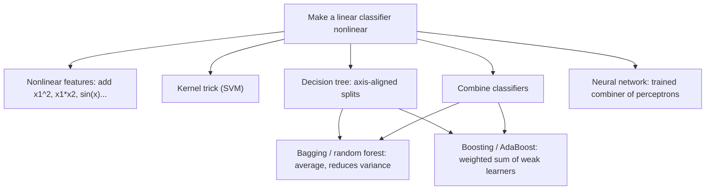

# ML 04 · Nonlinear classifiers

Back to [[00 MDL Index]] · previous [[ML 03 Linear classifiers]] · next [[ML 05 Evaluation]]
Slides: `week3a_NonLinearClassifiers` (David Tax)

## Big picture
Most nonlinear classifiers are built by **combining simple (often linear) pieces**. They need enough data; with little data keep the model simple or regularise.

## Nonlinear features
Keep the classifier linear in $w$, but feed it nonlinear functions of $x$:
$$\hat y=w_5x_2^2+w_4x_1^2+w_3x_1x_2+w_2x_2+w_1x_1+w_0$$
+ still trained with the linear machinery (e.g. [[Least squares|least squares]]). − number of terms explodes with degree and dimension, so [[Overfitting|overfitting]] (Assignment 4: degree 20 polynomial has a huge test error). You must guess the right features.

## Support vector classifier (preview)
[[Linear discriminant|Linear classifier]] with a **[[Margin|margin]]**: the band between $w^Tx+w_0=+1$ and $w^Tx+w_0=-1$. The [[Kernel trick|kernel trick]] makes it nonlinear. Details in [[ML 06 Complexity and SVM]].

## Decision trees
Each internal node tests **one feature** against a threshold and branches; each leaf outputs a class.

Split to reduce **[[Impurity|node impurity]]**. With $p_i=p(y_i\mid\text{node})$ estimated by counting:
$$\text{Entropy: } Q=-\sum_{i=1}^{C}p_i\log p_i\qquad\text{Gini: } Q=\sum_{i=1}^{C}p_i(1-p_i)\qquad\text{or the classification error}$$
A pure node has $Q=0$; a 50/50 node is the worst. Search all features and thresholds exhaustively and take the split that lowers impurity most.

Stop when: $Q$ stops improving, the node is pure enough, or a maximum depth is reached.

**[[Decision stump]]**: a tree with only the root split. Extremely weak, but the only model where the classification error itself can be minimised directly.

| + | − |
|---|---|
| simple to train, fast to run, interpretable | can grow large; needs stopping/pruning rules; moderate accuracy; **unstable** (removing one training point can change the whole tree) |

## Stabilising trees: bagging and random forests
Averaging identical trees does nothing (same data gives the same tree), so inject randomness.

**[[Bagging]]** ([[Bootstrapping|bootstrap]] aggregating), works for any classifier:
1. Sample $N$ objects **with replacement** from the training set (a bootstrap sample).
2. Fit a classifier $\hat y_m(x)$.
3. Repeat $M$ times and average: $\hat y_{\text{bag}}(x)=\dfrac1M\sum_{m=1}^{M}\hat y_m(x)$

If the individual errors were uncorrelated with zero mean, $E_{\text{bag}}=\dfrac1M E_{\text{AV}}$ (PRML p. 656). In practice errors are correlated so the gain is smaller.

**[[Random forest]]** = bagged trees + a random subset of features (possibly per node).

+ reduces variance, always applicable, trains in parallel. − unclear how many to combine; many models to train and store; on very large datasets bootstraps may be too similar.

## Boosting and AdaBoost
Instead of averaging independent models, build a **weighted sum of weak classifiers sequentially**, each one focusing on the mistakes of the previous ones:
$$\hat y(x)=\operatorname{sign}\Big(\sum_{m=1}^{M}\alpha_m\,\hat y_m(x)\Big)$$

[[AdaBoost]]:
1. Give every object the same weight.
2. Train a weak classifier $\hat y_m$ (e.g. a decision stump) on the weighted data.
3. Compute its weighted error $\varepsilon_m$.
4. Classifier weight: $\alpha_m=\tfrac12\log\dfrac{1-\varepsilon_m}{\varepsilon_m}$
5. Multiply the weights of misclassified objects by $\exp(\alpha_m)$.
6. Go to 2.

Equivalent object-weight form: $w_i=\exp\big(-y_i\sum_{k=1}^{K-1}\alpha_kf_k(x_i)\big)$. Final classifier $F_K(x)=\sum_k\alpha_kf_k(x)$.

Reading $\alpha_m$: error 0.5 (chance) gives $\alpha=0$; smaller error gives a bigger say.

| | Bagging | Boosting |
|---|---|---|
| Base models | independent, in parallel | sequential, each depends on the last |
| Combination | plain average | weighted sum |
| Mainly reduces | variance | bias |
| Base learner | unstable/complex (full trees) | weak/simple (stumps) |

## Combining classifiers
Feed the outputs ([[Posterior probability|posteriors]]) of several base classifiers into a combiner.
- Fixed combiner (average): helps only if the base classifiers are **diverse**. [[LDA]] + logistic + [[Perceptron|perceptron]] are too similar.
- Very different classifiers (LDA, [[QDA]], [[Parzen density estimate|Parzen]]) averaged: often no better than the best one.
- **Trained combiner** learns each classifier's strengths. A trained combiner on top of perceptrons is a [[Feed-forward network|neural network]], trained with [[Backpropagation|backprop]]: [[DL 03 Backpropagation]].

## Likely exam questions
- Compute entropy or Gini impurity for a node and the gain of a split.
- Why are trees unstable, and how does a random forest fix it?
- List the AdaBoost steps; compute $\alpha_m$ for a given error.
- Bagging vs [[Boosting|boosting]] differences.
- Why does combining similar classifiers not help?
- Pros and cons of adding polynomial features.

## Books
PRML 14 (14.2 bagging and committees, 14.3 boosting / AdaBoost, 14.4 tree-based models), 3.1 (basis functions). DL book 7.11 (bagging).

## Flashcards
#flashcards/MDL/Week3

How do nonlinear features make a linear classifier nonlinear?::Add terms like $x_1^2$, $x_1x_2$; the model stays linear in $w$ but the boundary is nonlinear in $x$

Drawback of adding polynomial features::The number of terms explodes with degree and dimension, so it overfits

What does a decision tree node do?::Tests one feature against a threshold and branches; a leaf outputs a class

Entropy impurity::$Q=-\sum_i p_i\log p_i$ with $p_i=p(y_i\mid\text{node})$

Gini impurity::$Q=\sum_i p_i(1-p_i)$

What is a decision stump?::A tree with a single split. The only model for which the classification error can be minimised directly.

When do you stop splitting a tree?::Impurity no longer improves, the node is pure enough, or maximum depth is reached

Main weakness of decision trees::Instability, removing one training object can change the whole tree

What is bagging?::Bootstrap aggregating. Train $M$ classifiers on bootstrap samples (drawn with replacement) and average, $\hat y_{bag}=\frac1M\sum_m\hat y_m$

Error reduction of bagging under uncorrelated errors::$E_{bag}=\frac1M E_{AV}$

What is a random forest?::Bagged decision trees plus a random subset of features (possibly per node)

Why does averaging identical trees not help?::The same data gives exactly the same tree, so randomness must be injected

What is boosting?::A weighted sum of weak classifiers trained sequentially, each focusing on the objects the previous ones got wrong

AdaBoost classifier weight::$\alpha_m=\tfrac12\log\dfrac{1-\varepsilon_m}{\varepsilon_m}$

AdaBoost reweighting step::Multiply the weights of misclassified objects by $\exp(\alpha_m)$

AdaBoost final classifier::$\operatorname{sign}\big(\sum_m\alpha_m\hat y_m(x)\big)$

Bagging vs boosting::Bagging, independent models, plain average, reduces variance. Boosting, sequential models, weighted sum, reduces bias.

When does combining classifiers help?::When the base classifiers are diverse. Similar classifiers add nothing.

What is a trained combiner of perceptrons?::A neural network, trained with error backpropagation
